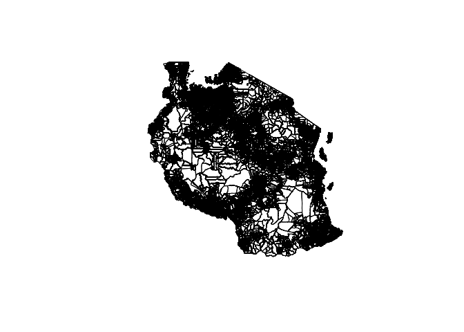

<!-- README.md is generated from README.Rmd. Please edit that file -->

# tanzania: Datasets for Use in Designing Surveys in Tanzania

<!-- badges: start -->

[](https://www.repostatus.org/#active)
[](https://github.com/spatialworks/tanzania/actions?query=workflow%3AR-CMD-check)
<!-- badges: end -->

Designing surveys require relevant datasets to be used as basis for
sample size calculations, sampling design, survey planning/logistics and
survey implementation. These include datasets on population, lists of
sampling clusters, map datasets for spatial sampling, and previous
survey datasets that can be used for estimating indicator variance and
design effects. This package contains relevant datasets for use in
designing surveys in Tanzania.

## Installation

The development version of the `tanzania` package can be installed from
[GitHub](https://github.com/spatialworks/tanzania) with:

``` r
if(!require(remotes)) install.packages("remotes")
remotes::install_github("spatialworks/tanzania")
```

## Usage

When installing `tanzania`, geospatial packages on which `tanzania`
depends on are also installed. To use `tanzania` package, it will be
important to load these package dependencies that have been installed.
This can be done by:

``` r
library(rgdal)
library(rgeos)
library(raster)
```

### Region borders

The Tanzania region borders is accessed via the `region` dataset.

``` r
tanzania::region
#> class       : SpatialPolygonsDataFrame 
#> features    : 30 
#> extent      : 29.38074, 40.44564, -11.76401, -0.9857875  (xmin, xmax, ymin, ymax)
#> crs         : +proj=longlat +datum=WGS84 +no_defs 
#> variables   : 2
#> names       : Region_Cod, Region_Nam 
#> min values  :         01,     Arusha 
#> max values  :         55,      Tanga
```

The region borders of Tanzania can be plotted by:

``` r
sp::plot(tanzania::region)
```


### District borders

The Tanzania district borders is accessed via the `district` dataset.

``` r
tanzania::district
#> class       : SpatialPolygonsDataFrame 
#> features    : 195 
#> extent      : 29.59019, 40.44564, -11.76401, -0.9857875  (xmin, xmax, ymin, ymax)
#> crs         : +proj=longlat +datum=WGS84 +no_defs 
#> variables   : 4
#> names       : Region_Nam, Region_Cod, District_C, NewDist20 
#> min values  :     Arusha,          1,          1, Arusha DC 
#> max values  :      Tanga,         55,         11,      Wete
```

The district borders of Tanzania can be plotted by:

``` r
sp::plot(tanzania::district)
```


### Ward borders

The Tanzania ward borders is accessed via the `ward` dataset.

``` r
tanzania::ward
#> class       : SpatialPolygonsDataFrame 
#> features    : 3644 
#> extent      : 29.59019, 40.44564, -11.76401, -0.9857875  (xmin, xmax, ymin, ymax)
#> crs         : +proj=longlat +datum=WGS84 +no_defs 
#> variables   : 9
#> names       : Region_Cod, Region_Nam, District_C, District_N, Ward_Code, Ward_Name, Division,      SHAPE_Leng,       SHAPE_Area 
#> min values  :         01,     Arusha,         01,     Arusha,       011,   Aghondi,    Amani, 0.0103364558854, 5.9905934117e-06 
#> max values  :         55,      Tanga,         10,       Wete,       452,      Zuzu,   Ziwani,   6.39559993421,   0.928253270256
```

The ward borders of Tanzania can be plotted by:

``` r
sp::plot(tanzania::ward)
```


### Village borders

The Tanzania village borders is accessed via the `village` dataset.

``` r
tanzania::village
#> class       : SpatialPolygonsDataFrame 
#> features    : 18421 
#> extent      : 29.5939, 40.44502, -11.74633, -0.990231  (xmin, xmax, ymin, ymax)
#> crs         : +proj=longlat +a=6378249.145 +rf=293.465006079117 +no_defs +type=crs 
#> variables   : 45
#> names       : REG_CODE, REGNAME, DIST_CODE, DISTNAME, WARD_CODE, WARD_NAME,        STREET,  MALE, FEMALE, TOTAL, NUMBER, AVERAGE, SINGLE, MARIED, UNKNOWN, ... 
#> min values  :       01,  Arusha,        01,  Arumeru,       011,   Aghondi,            ??,     0,      0,     0,      0,       0,      0,      0,       0, ... 
#> max values  :       55,   Tanga,        08,     Wete,       481,      Zuzu, Zuzu - Soweto, 41574,  43101, 84675,  84675,   544.5,  57386,  21310,    5979, ...
```

The village borders of Tanzania can be plotted by:

``` r
sp::plot(tanzania::village)
```



### Livelihood zones borders

The Tanzania livelihood zone borders is accessed via the
`livelihood_zone` dataset.

``` r
tanzania::livelihood_zone
#> class       : SpatialPolygonsDataFrame 
#> features    : 80 
#> extent      : 29.32717, 40.44556, -11.76007, -0.990736  (xmin, xmax, ymin, ymax)
#> crs         : +proj=longlat +datum=WGS84 +no_defs 
#> variables   : 15
#> names       : OBJECTID,       FNID, EFF_YEAR, COUNTRY, LZNUM, LZCODE,                                          LZNAMEEN, LZNAMEFR, LZNAMESP, LZNAMEPT, CLASS, LZSZCODE, LZTYPE, MAINCROPS, MAINLSTOCK 
#> min values  :        0, TZ2009L101,     2009,      TZ,     1,   TZ01, Babati Kwaraa Maize, Beans, Sunflower, and Coffee,       NA,       NA,       NA,    NA,       NA,     NA,        NA,         NA 
#> max values  :        0, TZ2009L199,     2009,      TZ,    99,   TZ99,     Western Lakeshore Coffee, Fishing, and Banana,       NA,       NA,       NA,    NA,       NA,     NA,        NA,         NA
```

The livelihood zone borders of Tanzania can be plotted by:

``` r
sp::plot(tanzania::livelihood_zone)
```


